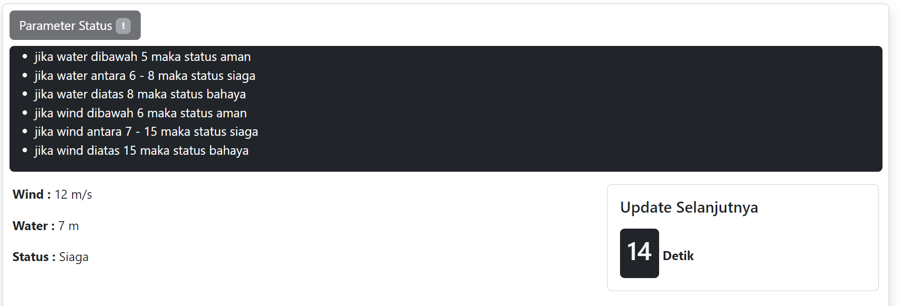

# Assignment 3 Golang Class

Ini adalah tugas kedua untuk kelas Golang yang diselenggarakan Hacktiv8 Indonesia.

## Deskripsi

Tugas ini mengenai pembuatan microservice untuk meng-update sebuah file json setiap 15 detik dengan angka random antara 1-100 untuk value water dan wind. 

Dengan ketentuan:
- jika water dibawah 5 maka status aman●jika water antara 6 - 8 maka status siaga
- jika water diatas 8 maka status bahaya
- jika wind dibawah 6 maka status aman●jika wind antara 7 - 15 maka status siaga
- jika wind diatas 15 maka status bahaya
- value water dalam satuan meter 
- value wind dalam satuan meter per detik
- halaman tersebut selalu up-to-date (auto reload)


## Teknologi yang dipakai

- Javascript
- HTML/CSS
- Golang

## Cara menjalankan
1. Masuk ke direktori projek
2. Jalankan microservice dengan mengetikkan di terminal

```
go run main.go
```
3. Buka halaman http://localhost:8080/status
